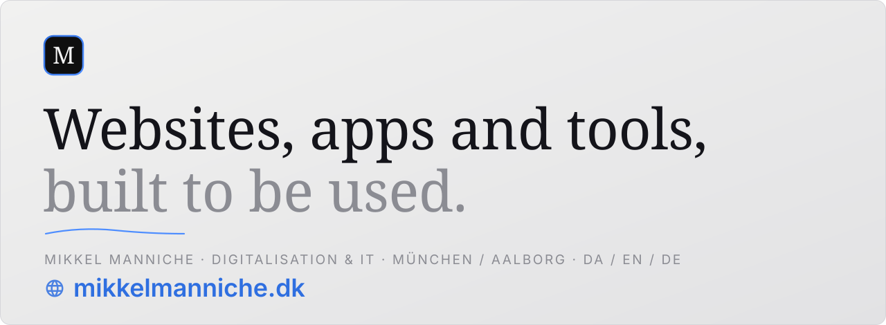

<a href="https://mikkelmanniche.dk/en/">
  <picture>
    <source media="(prefers-color-scheme: dark)" srcset="assets/banner-dark.svg">
    
  </picture>
</a>

<a href="https://mikkelmanniche.dk/en/contact"><picture><source media="(prefers-color-scheme: dark)" srcset="assets/button-quote-dark.svg"></picture></a>&nbsp;
<a href="https://calendly.com/kontakt-mikkelmanniche/30min"><picture><source media="(prefers-color-scheme: dark)" srcset="assets/button-call-dark.svg"></picture></a>

## Recent work

| | |
| :--- | :--- |
| **[TerjePedersen.dk](https://mikkelmanniche.dk/en/cases/terjepedersen)** | Personal site built from scratch. Four pages, and no cookie banner, because the site doesn't pass on visitor data. |
| **[TPOnlineMedia.com](https://mikkelmanniche.dk/en/cases/tponlinemedia)** | Website in three languages, an admin panel and an automatic website check, where 548 of 550 measurements matched an independent browser measurement. |
| **[finance.mikkelmanniche.dk](https://mikkelmanniche.dk/en/cases/finance)** | My own finance app. Pulls transactions from two banks through open banking into my own database. |
| **[mikkelmanniche.dk](https://mikkelmanniche.dk/en/cases/mikkelmanniche)** | Hand-written from scratch in Danish, English and German. Your browser contacts no third party until you've said yes. |

## Open source

**[dk-regnskab-mcp](https://github.com/mikkelmanniche-dk/dk-regnskab-mcp)** gives Claude the published annual reports of Danish companies, read straight from the XBRL filings. Danish GAAP and IFRS, no API key.

More small tools at **[manniche labs](https://github.com/manniche-labs)**: receipt parsing for DE/DK VAT, Apache security hardening for SPAs, a Next.js starter.

 

<a href="https://mikkelmanniche.dk/en/contact">
  <picture>
    <source media="(prefers-color-scheme: dark)" srcset="assets/band-dark.svg">
    
  </picture>
</a>
